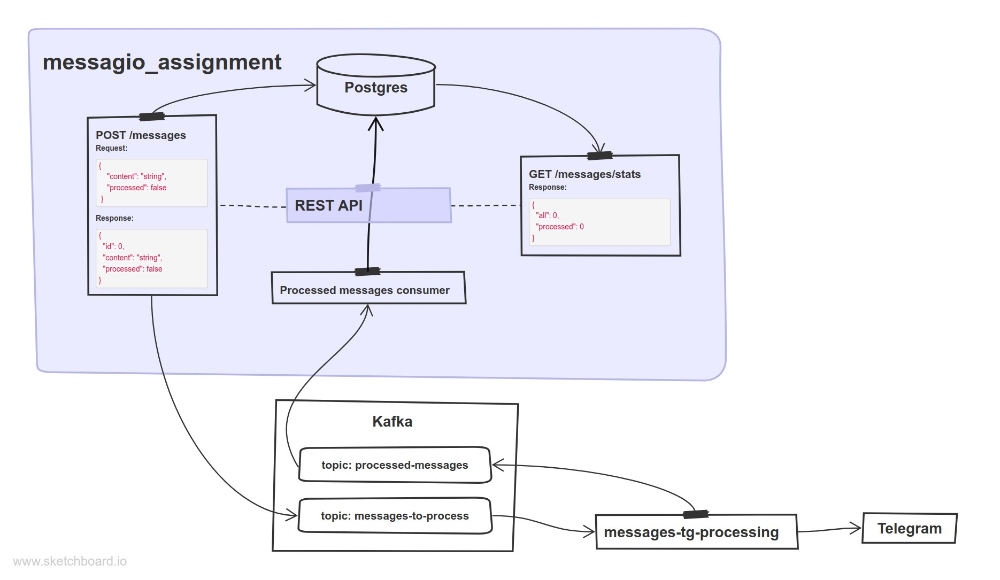

# messagio_assigment

[](https://codecov.io/gh/Kugeki/messagio_assignment)
[](https://goreportcard.com/report/github.com/Kugeki/messagio_assignment)


Тестовое задание в Messagio. 

Пример микросервиса, который 
читает сообщения из Kafka, находится в репозитории
[messagio_tg_processing](https://github.com/Kugeki/messagio_tg_processing).
В нём реализована отправка полученных сообщений в
телеграм-канал.

## Задание
Разработать микросервис на Go, который будет принимать сообщения через HTTP API, сохранять их в PostgreSQL, а затем отправлять в Kafka для дальнейшей обработки. Обработанные сообщения должны помечаться. Сервис должен также предоставлять API для получения статистики по обработанным сообщениям.
Требования:
1.	Использовать Go 1.20+
2.	Использовать PostgreSQL для хранения сообщений
3.	Реализовать отправку и чтение сообщений в Kafka
4.	Предоставить возможность запустить проект в Docker

## Содержание
- [Запуск](#запуск)
- [API](#api)
- [Используемые технологии](#используемые-технологии)
- [Основные фичи решения](#основные-фичи-решения)
- [Архитектура решения](#архитектура-решения)
- [Описание структуры проекта](#описание-структуры-проекта)

## Запуск
```
docker compose -d --build
```

## API
### REST
Описание API находится в файле [api.md](api.md).

Также при запуске сервера доступна Swagger страница по адресу
`/` или `/swagger/` с описанием API и возможностью протестировать его.

### Kafka
Описание находится в файле [kafka.md](kafka.md).

## Используемые технологии
- REST API (go-chi)
- PostgreSQL (pgx)
- Kafka (sarama) и kafka-ui (:8090)
- Docker и docker-compose.
- Testcontainers
- Swagger

## Основные фичи решения
- Юнит и интеграционные тесты для PostgreSQL и REST API.
- Чистая архитектура (также известна как луковичная, гексагональная).
- Graceful shutdown.
- Continious Integration с GitHub Actions.
- Логирование и конфигурация приложения.
- Swagger-документация.
- Rate-Limitting.
- Миграции БД и сетап топиков у брокера сообщений.


## Архитектура решения


## Описание структуры проекта
    .
    ├── cmd
    │   ├── envdescription  # Программа для генерации описания env конфига.
    │   └── server          # Сервер
    ├── configs             # Конфиги
    ├── docs                # Swagger-документация
    ├── internal
    │   ├── adapters        # Адаптеры (клиенты)
    │   │   ├── kafkaprod   # Kafka Producers
    │   │   │   └── dto     # Data Transfer Object для kafkaprod
    │   │   └── pgstore     # PostgreSQL хранилище
    │   ├── config          # Пакет для работы с конфигами
    │   ├── domain          # Доменные модели
    │   │   └── message     # Модели для того, что относится к сообщению
    │   ├── graceful        # Пакет для Graceful Shutdown
    │   ├── logger          # Пакет для логгинга
    │   ├── ports           # Порты (компоненты, к которым обращаются извне)
    │   │   ├── kafkacons   # Kafka Consumers
    │   │   │   └── dto     # Data Transfer Object для kafkacons
    │   │   └── rest        # HTTP сервер с REST API
    │   │       ├── dto     # Data Transfer Object для rest
    │   │       └── mocks   # Моки для usecases в rest
    │   └── usecases        # Сценарии использования
    └── migrations          # Миграции для БД

Структура проекта построена в соответствии с чистой 
архитектурой.


Data Transfer Object нужен для сериализации и десереализации
запросов и ответов.